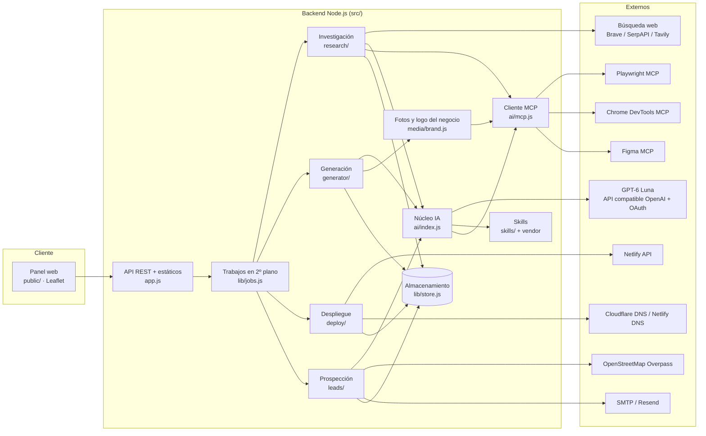
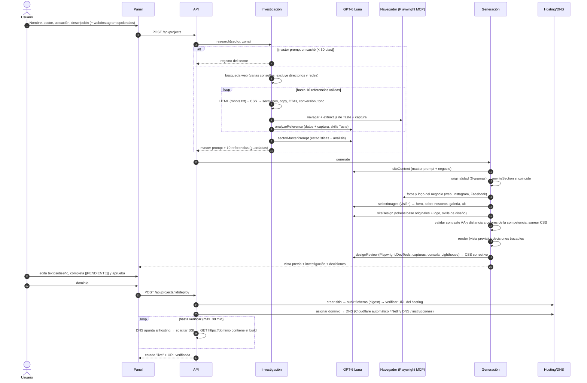
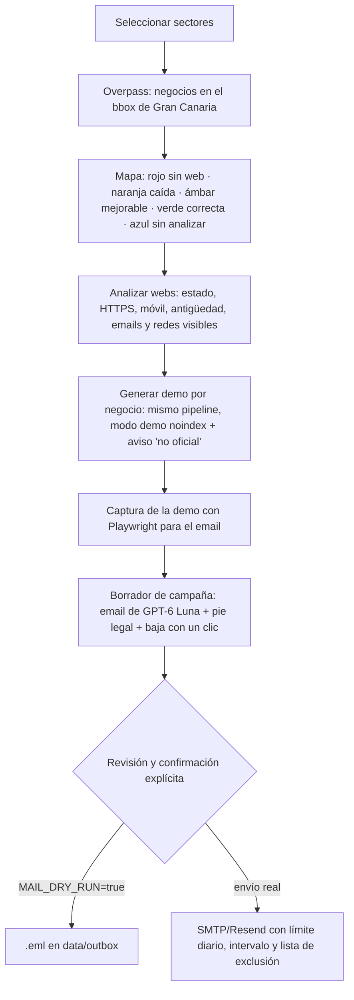

# Open Webs — Especificación técnica

Plataforma SaaS que automatiza la creación de la web de un negocio de principio a fin: investiga el sector (≥ 10 webs de referencia), sintetiza un **master prompt** por sector, genera contenido y diseño originales con **GPT-6 Luna** (con skills de diseño y herramientas de navegador), permite revisar/editar, publica en hosting con el dominio del cliente y **verifica** que la web responde públicamente. Incluye un **mapa de prospección de Gran Canaria** que localiza negocios, detecta si tienen web, genera una demo para cada uno y la envía por email.

---

## 1. Arquitectura

| Capa | Tecnología | Ubicación |
|---|---|---|
| Frontend (panel) | HTML + JS sin build, Leaflet para el mapa | `public/` |
| Backend | Node.js 20+ (ESM), servidor HTTP propio, sin framework | `src/app.js`, `src/server.js` |
| Motor de generación | Especificación JSON → HTML/CSS estático con SEO | `src/generator/` |
| IA | Proveedores intercambiables, OAuth, skills, MCP | `src/ai/` |
| Persistencia (MVP) | Ficheros JSON + secretos cifrados AES-256-GCM | `src/lib/store.js` → PostgreSQL + S3 en fase 2 |
| Cola de trabajos (MVP) | En proceso, con registro por trabajo | `src/lib/jobs.js` → BullMQ/pg-boss en fase 2 |

### 1.1 Núcleo de IA modular (`src/ai/`)

- **Proveedores** (`ai/index.js`): cada rol (`research`, `generation`) se configura con `proveedor:modelo` (`AI_RESEARCH=openai:gpt-6-luna`). Añadir un proveedor = implementar `generateJSON({ task, system, prompt, input, tools, images })` y registrarlo. El resto de la plataforma no cambia.
- **GPT-6 Luna** (`ai/providers/openai.js`): API compatible con OpenAI Chat Completions, respuesta JSON, visión (capturas y fotos), bucle de *tool calling*, reintentos con backoff y renovación del token ante 401.
- **OAuth 2.0** (`ai/auth/oauth.js`): `client_credentials` (servidor a servidor, p. ej. Azure OpenAI con Entra ID o un gateway) o `authorization_code + PKCE` (el operador conecta su cuenta desde el panel). Tokens cacheados, refrescados y cifrados en disco.
- **Tareas** (`ai/prompts.js`): `analyzeReference`, `sectorMasterPrompt`, `siteContent`, `rewriteSection`, `siteDesign`, `designReview`, `selectImages`, `figmaImport`, `outreachEmail`.
- **Skills** (`ai/skills.js`): 50 skills. 25 propias (`skills/*/SKILL.md`) y 25 de terceros descargadas de sus repos originales y fijadas por commit (`skills/vendor.lock.json`, `npm run skills:sync`): Taste, Frontend Design (Anthropic), Impeccable, Emil Kowalski y Figma. Cada skill declara `tasks`, `sectors`, `requires` y `load` (`inject`: va siempre en el prompt; `tool`: GPT-6 Luna la carga bajo demanda con `load_skill`).
- **MCP** (`ai/mcp.js`): cliente JSON-RPC (stdio y Streamable HTTP) que expone a GPT-6 Luna las herramientas de **Playwright MCP** (Microsoft), **Chrome DevTools MCP** (Google) y **Figma MCP** (OAuth con registro dinámico, `ai/mcp-oauth.js`), con lista blanca por tarea y bloqueo de destinos privados (SSRF).
- **Trazabilidad**: cada resultado guarda proveedor, modelo, skills cargadas y herramientas usadas.

| Tarea | Skills clave | Herramientas MCP |
|---|---|---|
| analyzeReference | Taste (medir, patrones, ADN), competitive-analysis, conversion-audit | Playwright |
| sectorMasterPrompt | master-prompt-synthesis, Taste (ADN, observer), local-seo-canarias | — |
| siteContent | no-fabrication, spanish-copy-es, conversion-copywriting, local-seo-canarias, reglas sectoriales | — |
| siteDesign | Frontend Design, Impeccable (+ typeset, colorize, layout, animate), Emil Kowalski | — |
| designReview | visual-qa-checklist, Impeccable (critique, polish, audit), Emil (review-animations) | Playwright, Chrome DevTools (consola, Lighthouse) |
| selectImages | photo-selection, accessibility-content | — (visión) |
| figmaImport | Figma (design-to-code, use) | Figma MCP |
| outreachEmail | outreach-email-lssi, email-deliverability, no-fabrication | — |

---

## 2. Flujo de datos paso a paso

### 2.1 Prospección en Gran Canaria

---

## 3. Modelo de datos (resumen)

| Entidad | Campos principales |
|---|---|
| `sectors/<sector--zona>` | referencias (url, secciones, colores, fuentes, CTAs, conversión, tono, medidas del navegador, captura, análisis IA), estadísticas agregadas, síntesis, **masterPrompt**, metadatos IA |
| `projects/<id>` | input del negocio, `result` (spec de páginas, diseño/tokens/CSS, media, originalidad, decisiones, QA, IA), aprobación, `deploy` (sitio, build, DNS, estado, URL verificada) |
| `leads/<id>` | datos OSM (nombre, sector, coordenadas, web, email, teléfono, redes), estado web, demo, estado de contacto |
| `campaigns/<id>` | mensajes (destinatario, asunto, texto, HTML, demo, estado, fecha), omitidos y motivo |
| `suppression/list` | emails dados de baja |
| `secrets/*` | tokens OAuth (IA, Figma) cifrados |

---

## 4. APIs y servicios externos

| Categoría | Servicio | Uso | Autenticación | ¿Obligatorio? |
|---|---|---|---|---|
| IA | **GPT-6 Luna** (API compatible con OpenAI: OpenAI, Azure OpenAI o gateway) | Análisis, síntesis, copy, diseño, QA, selección de fotos y emails | **OAuth 2.0** (o API key) | Sí (modo mock para demo) |
| Búsqueda web | Brave Search API / SerpAPI (Google) / Tavily | Encontrar ≥ 10 webs de referencia por sector | API key | Sí en producción |
| Navegador | Playwright MCP (`@playwright/mcp`, Microsoft) | Medir referencias (Taste), fotos/logo, capturas y QA | — (local) | Recomendado |
| Depuración | Chrome DevTools MCP (`chrome-devtools-mcp`, Google) | Consola, red, rendimiento y Lighthouse en la QA | — (local) | Opcional |
| Diseño | Figma MCP remoto (`mcp.figma.com`) | Leer la marca del cliente desde Figma | OAuth (registro dinámico) | Opcional |
| Hosting | Netlify API | Crear sitio, desplegar, dominio, SSL, formularios | Token personal / OAuth | Sí en producción |
| DNS | Cloudflare API · Netlify DNS | Registros A/CNAME automáticos o nameservers | Token con Zone.DNS:Edit | Opcional (hay modo manual) |
| Dominios | RDAP (rdap.org) | Comprobar si un dominio está libre | — | Opcional |
| Mapa | OpenStreetMap Overpass + teselas | Negocios de Gran Canaria y mapa | — | Sí para prospección |
| Email | SMTP (nodemailer) / Resend | Enviar demos | Credenciales | Solo para envío real |

Alternativas intercambiables: Vercel o Cloudflare Pages (hosting), Namecheap/Porkbun (registro y compra de dominios), Google Places (mapa), SendGrid/Brevo (email).

### 4.1 API REST de la plataforma

| Método | Ruta | Descripción |
|---|---|---|
| GET | `/api/status` · `/api/skills` · `/api/mcp/status` | Configuración, skills y estado de los MCP |
| POST | `/api/projects` | Crear proyecto e iniciar investigación + generación |
| GET | `/api/projects/:id` · `/api/projects/:id/research` | Proyecto, referencias y master prompt |
| PUT | `/api/projects/:id/spec` | Editar textos, tokens y variante de hero |
| POST | `/api/projects/:id/approve` | Aprobar |
| GET | `/api/domains/check?domain=` | Disponibilidad del dominio (RDAP) |
| POST | `/api/projects/:id/deploy` · `/verify` | Publicar con dominio y verificar |
| GET/POST | `/api/sectors` · `/api/sectors/research` · `/api/sectors/:id` | Master prompts por sector |
| GET/POST | `/api/leads` · `/api/leads/search` · `/enrich` · `/demos` | Prospección |
| GET/POST | `/api/campaigns` · `/api/campaigns/:id/send` | Campañas (envío con `confirm: true`) |
| GET | `/api/jobs/:id` | Estado y registro de un trabajo |
| GET | `/auth/llm/start` · `/auth/figma/start` | Conexión OAuth |
| GET/POST | `/unsubscribe` | Baja de emails |
| GET | `/preview/:id/` · `/demo/:id/` · `/published/:id/` | Vistas previas, demos y publicación local |

---

## 5. Calidad, seguridad y cumplimiento

- **Originalidad**: detección de fragmentos de 6 palabras compartidos con las referencias y reescritura automática. Colores con distancia mínima a los de la competencia y fuentes de titulares distintas de las más usadas. CSS propio.
- **Veracidad**: los datos desconocidos quedan como `[[PENDIENTE]]` y bloquean la publicación hasta completarlos (o forzar su omisión).
- **Accesibilidad**: contraste AA validado por código, un único H1, foco visible, `prefers-reduced-motion`.
- **SEO**: meta títulos y descripciones, canonical, Open Graph, Schema.org (subtipo de LocalBusiness por sector, FAQPage, BreadcrumbList), sitemap y robots. Las demos son `noindex`.
- **Seguridad**: bloqueo SSRF en scraping, descargas y MCP. Respeto de robots.txt. CSS de la IA saneado. HTML escapado. Tokens OAuth cifrados. `PANEL_TOKEN` comparado en tiempo constante. Protección contra *path traversal*.
- **Prospección (LSSI/RGPD)**: modo simulación por defecto, confirmación explícita por campaña, identificación del remitente con dirección (obligatoria para enviar), carácter comercial y motivo del contacto, baja con un clic (`List-Unsubscribe` + enlace firmado con HMAC), lista de exclusión, límite diario e intervalo. La LSSI (art. 21) exige consentimiento previo para comunicaciones comerciales por email: la responsabilidad del envío es del operador.
- **Fotos y logo del negocio**: se recogen navegando sus páginas públicas (web, Instagram, Facebook) por decisión del operador, que asume el riesgo. Instagram y Facebook limitan el acceso automatizado y suelen responder HTTP 429 o pedir login desde IPs de centros de datos. La plataforma registra el bloqueo y no intenta saltarlo. Cada imagen guarda su URL de origen y las demos llevan el aviso "no es la web oficial".

---

## 6. Plan de implementación por fases

### Fase 1 — MVP (implementada en este repositorio)
- Investigación con ≥ 10 referencias, medición con navegador (Taste) y **master prompt por sector** con caché.
- GPT-6 Luna por OAuth con 50 skills y herramientas MCP (Playwright, Chrome DevTools, Figma).
- Generación de 4 páginas con SEO, originalidad, diseño a medida y revisión visual automática.
- Fotos y logo del negocio desde su web, Instagram y Facebook, con selección por visión.
- Panel: formulario → progreso → vista previa editable (escritorio/móvil) → aprobación → publicación.
- Despliegue en Netlify con DNS Cloudflare, Netlify DNS o manual, SSL y verificación pública.
- Mapa de Gran Canaria (OpenStreetMap) con análisis de webs, demos y campañas de email con salvaguardas.
- Tests (`npm test`), diagnóstico (`npm run doctor`) y modo demo sin credenciales (`npm run demo`).

### Fase 2 — Producción multiusuario
- PostgreSQL (proyectos, sectores, leads) + S3/R2 (capturas, fotos, sitios) detrás de la interfaz de `FileStore`.
- Cola persistente (BullMQ/Redis o pg-boss) con reintentos y trabajadores separados para navegador e IA.
- Autenticación de usuarios (OAuth/OIDC), organizaciones, roles y facturación (Stripe).
- Formularios de contacto con bandeja en el panel (Netlify Forms → webhook).
- Observabilidad: trazas de cada llamada a la IA (coste, latencia, skills y herramientas), Sentry.

### Fase 3 — Automatización completa
- Compra de dominios por API (Namecheap/Porkbun/Vercel Domains) con pago y consentimiento del cliente.
- Multidioma (ES/EN/DE para zonas turísticas) y blog SEO programado.
- Editor visual por bloques y regeneración de secciones individuales con GPT-6 Luna.
- Seguimiento de campañas (aperturas y respuestas) y conversión de demo a cliente con un clic (reutiliza el proyecto de la demo).
- Plantillas de sector aprendidas de las webs aprobadas: el master prompt se retroalimenta con lo que los clientes aceptan.

### Fase 4 — Escala
- Refresco periódico de master prompts por sector y zona. Comparativas entre islas o regiones.
- Evaluaciones automáticas de calidad (Lighthouse, accesibilidad, originalidad) como puerta de publicación.
- Marketplace de skills por sector y proveedores de IA alternativos por coste y calidad.

---

## 7. Limitaciones conocidas

- El identificador del modelo (`gpt-6-luna`) y la URL del proveedor se configuran por variables de entorno. `npm run doctor` comprueba que el proveedor lo lista.
- OpenStreetMap tiene pocos emails de negocios. La mayoría salen de visitar sus webs, y a los negocios sin web ni email no se les puede escribir (el mapa muestra su teléfono).
- Instagram y Facebook suelen bloquear la navegación automatizada desde servidores (HTTP 429 o login).
- La compra de dominios no está automatizada en el MVP: se comprueba la disponibilidad y el usuario compra el dominio en su registrador.
- Las teselas públicas de OpenStreetMap tienen una política de uso limitada. Para producción, configura `MAP_TILE_URL` con un proveedor propio.
